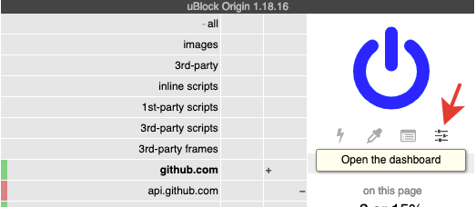
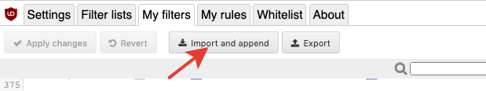
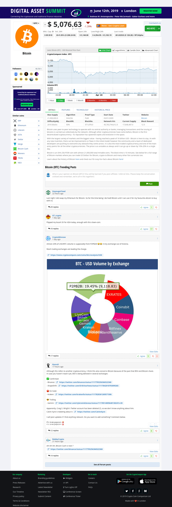
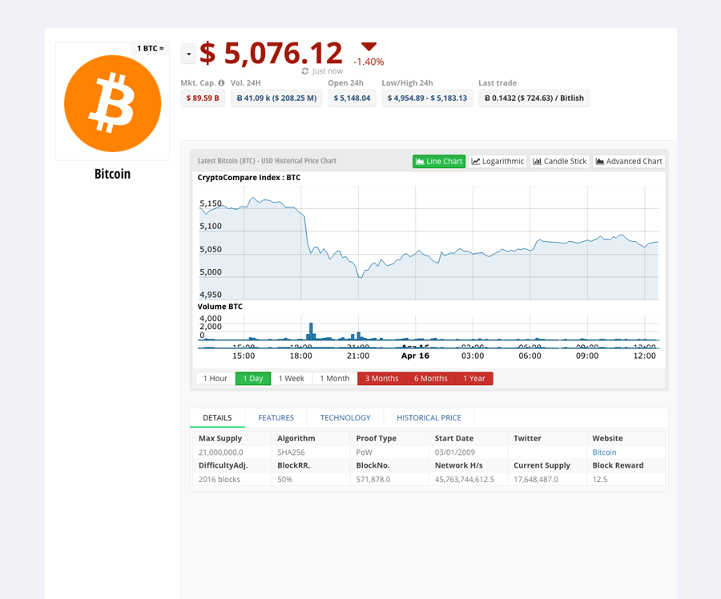

# CryptoCompareDeMoroniciser

This is just a Set of uBlock Origin rules which attempt to clean up the CryptoCompare website by removing the moronic junk such as; flashing ads, infantile discussion forum, useless guides, so-called news, etc] and just leaving the latest price charts and your portfolio.

*NOTE: these are just the rules I use to make the site palatable. They may remove stuff you actually want to see. Tweak as necessary*

## Usage

Open the uMatrix Origin Dashboard and then Use 'Import and Append' to add the rules in the `.txt` file to your filters.

### Before CryptoCompareDeMoroniciser...

### After CryptoCompareDeMoroniciser...

